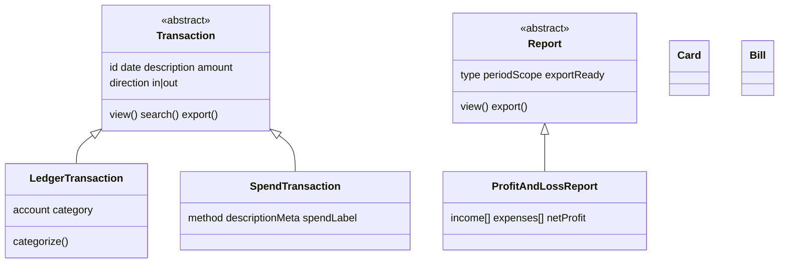

# HCP Prototype — System Model (OOUX)

Refined from prototype scan. **Four objects.** Period and Readiness are **views + scope**, not objects.

Artifacts: layout matrix and canvas in repo / Cursor canvases folder.

---

## 1. Core objects (four)

| Object | User says | Prototype source |
|--------|-----------|------------------|
| **Transaction** | "This charge" / "this deposit" | `AccountingTransactionRow`, `ExpensesTransactionRow`, Close ledger |
| **Report** | "October P&L" | `ProfitAndLossReport`, Close reports |
| **Card** | "April's card" | `ExpenseCardRow` |
| **Bill** | "Rivera Electric bill" | `BillPayRow` |

Nav (Expenses · Accounting · Close) = app structure, not objects.

The four concretes users care about sit on an **inheritance tree** — abstract parents define shared attributes and actions; children add module-specific fields.

---

## 2. Object tree (inheritance)

```
ORCA object tree
│
├── Transaction [abstract]
│   │   attrs:  id, date, description, amount, direction (in | out)
│   │   actions: view · search · export (batch)
│   │
│   ├── LedgerTransaction          ← Accounting module, Close prototype
│   │       + account, category? (nullable, tax-driving)
│   │       actions: + categorize · apply rule
│   │
│   └── SpendTransaction           ← Expenses module (activation)
│           + method, descriptionMeta, spendLabel
│           (category string — informational, not tax)
│
├── Report [abstract]
│   │   attrs:  type, periodScope (→ selectedMonth), exportReady
│   │   actions: view · export · toggleSection
│   │
│   └── ProfitAndLossReport
│           + businessName, income[], expenses[], netProfit
│           generated from LedgerTransaction[] in scope
│
├── Card [concrete]
│       attrs:  cardholder, purpose, type, status, limit, maskedNumber
│       actions: issue · freeze · export
│
└── Bill [concrete]
        attrs:  vendor, dueDate, amount, status
        actions: pay · schedule · export
```



### Inheritance rules

| Rule | Detail |
|------|--------|
| **Expense / deposit are not subclasses** | `direction` attribute on **Transaction** — filters and chart lenses only |
| **Close uses LedgerTransaction** | Same row shape as Accounting; Close is a flow, not a third child type |
| **Report is generated** | ProfitAndLossReport has no independent storage; recategorizing updates it |
| **Card / Bill are leaves** | No shared parent in v1 — different lifecycles (instrument vs payable) |
| **UI components target abstracts** | Row chrome, amount formatting, direction color → **Transaction**; category picker → **LedgerTransaction** only |

### Code map

| Tree node | Prototype type / module |
|-----------|-------------------------|
| `LedgerTransaction` | `AccountingTransactionRow` · Close ledger |
| `SpendTransaction` | `ExpensesTransactionRow` |
| `ProfitAndLossReport` | `ProfitAndLossReport` |
| `Card` | `ExpenseCardRow` |
| `Bill` | `BillPayRow` |

---

## 3. Parallel layers (not on object tree)

Inheritance covers **nouns**. These sit **beside** the tree — they scope or present objects but do not extend them.

```
Scope layer (view state)
├── selectedMonth      → scopes LedgerTransaction[], Report generation, Readiness
└── timeRange          → scopes SpendTransaction aggregates (Overview)

View layer (presentations)
├── ReadinessView      → dashboard over LedgerTransaction[] × scope
├── RegisterView       → list/filter UI for Transaction[]
├── ActivityView       → chart aggregates over SpendTransaction[]
└── ResolveView        → RegisterView + vendor clusters (Close / To review)
```

**Period** lives in **Scope layer** (`selectedMonth` + calendar reference data).  
**Readiness** lives in **View layer** — never subclass an object to model it.

---

## 4. Consolidating your scan

You named: *expense, deposit, transaction, card, bill, report* (+ duplicate card).

| You said | Verdict | Why |
|----------|---------|-----|
| **Transaction** | ✓ Object | Atomic money movement in every prototype |
| **Report** | ✓ Object | Deliverable with own screen + export |
| **Card** | ✓ Object | Issued instrument users manage |
| **Bill** | ✓ Object | Payable users track |
| **Expense** | ✗ Not an object | **Money-out Transaction** (`isDeposit: false`) or chart aggregate |
| **Deposit** | ✗ Not an object | **Money-in Transaction** (`isDeposit: true`) or chart aggregate |

Expense and deposit are how users **talk about** transactions and how charts **slice** them — not separate nouns in the data model.

```
Transaction
├── direction: in  (deposit)   ← Register segment "Money in", chart lens "Deposits"
└── direction: out (expense)   ← Register segment "Money out", chart lens "Spending"
```

Accounting adds nullable **category** on **LedgerTransaction**. Expenses adds **method** / merchant meta on **SpendTransaction** — siblings under **Transaction**, not separate roots.

---

## 5. Period — not an object

**What it feels like:** "October books"  
**What it actually is:** **Time scope** — the month you're looking at.

| Layer | What it is |
|-------|------------|
| **Calendar** | Fixed list of months (`ACCOUNTING_PERIODS`) — reference data, not user-created |
| **View state** | `selectedMonth` — shared by Transactions, Reports, Readiness drill |
| **Membership** | `transaction.date` falls in month — no Period entity |

There is no Period detail page. Opening "October" means opening **Transactions** or **Report** scoped to October.

**In UI:** period picker = scope control, like a date filter — not object navigation.

---

## 6. Readiness — not an object

**What it feels like:** "Am I tax ready?"  
**What it actually is:** A **view** — dashboard computed from Transactions (+ export rules for Report).

| Readiness shows… | Computed from… |
|------------------|----------------|
| Sorted % | Categorized Transaction count ÷ total in scope |
| Review count | Uncategorized Transaction in review window |
| Tax ready | Queue empty + all categorized in scope |
| Month tiles (year view) | Same stats per calendar month |

**Readiness tab** = **Close status view** (HCP Accounting Readiness · Close home).  
Actions link to **Transaction** work (categorize) or **Report** (export) — they don't mutate a "Readiness" thing.

```
Readiness view
  inputs:  Transaction[] × scope (one month | tax year)
  outputs: progress, counts, status labels
  actions: → Transactions (to review) · → Report
```

**Tax year** = UI grouping of calendar months in year Readiness — not an object.

---

## 7. View state (not objects)

| State | Role |
|-------|------|
| `selectedMonth` | Scopes Transaction list, Report generation, Readiness drill |
| `registerSegment` | all · toReview · out · in — filters Transaction |
| `reviewLayout` | grouped · focus — To review presentation |
| `timeRange` | Overview chart window |
| `searchQuery` | Register filter |
| Active module / tab | Shell navigation |

---

## 8. Computed views (not objects)

| UI pattern | What it is |
|------------|------------|
| Review queue | Filter: uncategorized Transaction in window |
| Vendor groups | Cluster uncategorized Transaction by description |
| Spending / deposits charts | Aggregate Transaction by direction + time |
| Register slice | Filtered Transaction[] |
| P&L sections | Report structure — lines aggregated from Transaction |

---

## 9. Relationships

```
selectedMonth (state) scopes:
LedgerTransaction[]  ──generates──▶  ProfitAndLossReport

Card  ──may source──▶  SpendTransaction   (Expenses)
Bill  (standalone in prototype)
```

---

## 10. Both prototypes mapped

| Close | HCP Accounting | Object / view |
|-------|----------------|---------------|
| Home stats | Readiness | **Readiness view** |
| Resolve | Transactions → To review | **LedgerTransaction** (filtered) |
| Ledger | Transactions → All | **LedgerTransaction** |
| Reports | Reports tab | **ProfitAndLossReport** |
| — | Expenses Overview | **SpendTransaction** aggregates (view) |
| — | Cards / Bills | **Card** / **Bill** |

Close and Accounting share the same object layer; Close is a narrower flow over Transaction + Report.

---

## 11. Design jobs → objects / views

| Job | Question | Answer |
|-----|----------|--------|
| Orient | Where am I? | View state + module tab |
| Prioritize | What needs me? | **Readiness view** over Transaction[] |
| Work | Categorize / scan | **LedgerTransaction** or **SpendTransaction** |
| Trust | Can I export? | **ProfitAndLossReport** |
| Monitor | Cash OK? | **SpendTransaction** aggregates (ActivityView) |
| Manage spend | Cards / bills | **Card** / **Bill** |

---

## 12. Layout matrix (unchanged tiers)

| View | Primary input | Tier |
|------|---------------|------|
| Readiness (year) | Readiness view × all months | A |
| Readiness (month) | Readiness view × selectedMonth | B2 |
| Transactions browse | LedgerTransaction[] | B + C |
| To review | LedgerTransaction[] + vendor clusters | B2 + C |
| Reports | ProfitAndLossReport | B |
| Expenses Overview | SpendTransaction aggregates | A |
| Cards / Bills | Card[] / Bill[] | B + C |

---

## 13. Pre-build checklist

- [ ] Which **tree node** is on screen? (abstract or concrete)
- [ ] Does UI target **Transaction** base or a **child** type?
- [ ] What **selectedMonth** or **timeRange** scopes it?
- [ ] Is this a **View layer** presentation (Readiness, Activity)?
- [ ] Are expense/deposit **direction filters** on Transaction?
- [ ] Layout tier A / B / B2 / C?

---

## 14. Promote to object when…

| Trigger | Add |
|---------|-----|
| User locks/closes a month as entity | **Period** (revisit) |
| User manages chart of accounts | **Category** |
| User manages bank connections | **Account** |
| User manages match rules in a list | **Rule** |
| New statement types | New **Report** subclass (e.g. `BalanceSheetReport`) |

---

## Revision log

| Date | Change |
|------|--------|
| 2026-06-23 | Verbose OOUX model |
| 2026-06-23 | Consolidated to 4–5 objects |
| 2026-06-23 | **Final four:** Transaction, Report, Card, Bill — Period & Readiness demoted |
| 2026-06-23 | **Inheritance tree** — Transaction & Report abstracts + concrete children |
